# TalentPilot Web

Next.js frontend for TalentPilot, an AI-assisted ATS resume optimizer and job-application prep tool.

## Overview

Job seekers often don't know why a resume gets filtered out, or how to tailor it to a specific role without exaggerating. TalentPilot scores a resume against a job description, explains the gaps, and proposes grounded edits. It also prepares a cover letter, interview practice, company research, a salary estimate and a learning roadmap for the same role. This repository is the web client; the backend lives in [talentpilot-api](https://github.com/njkr/talentpilot-api).

## Screenshots

### Desktop

<table>
  <tr>
    <td>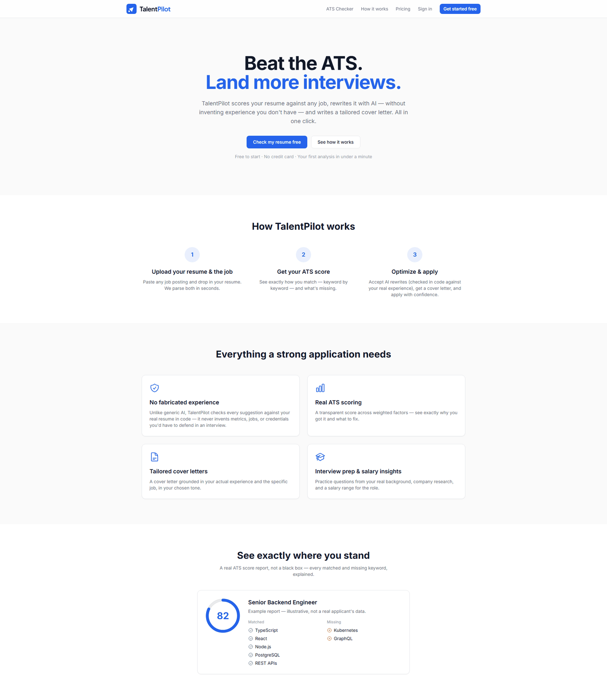<br><sub>Landing page: hero, how it works, features and a sample ATS report</sub></td>
    <td>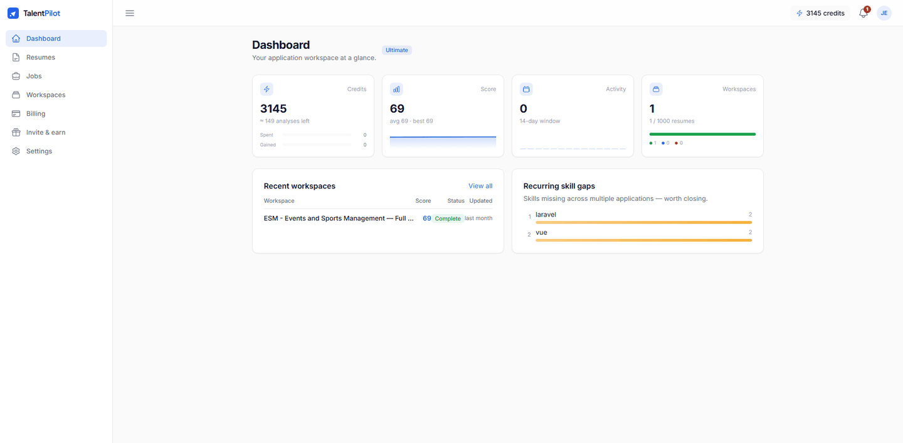<br><sub>Dashboard: credits, average score, activity, workspaces and recurring skill gaps</sub></td>
  </tr>
  <tr>
    <td>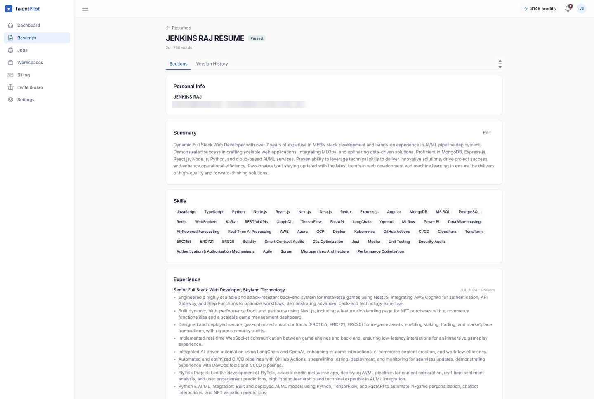<br><sub>Uploaded resume parsed into structured sections (contact details redacted)</sub></td>
    <td>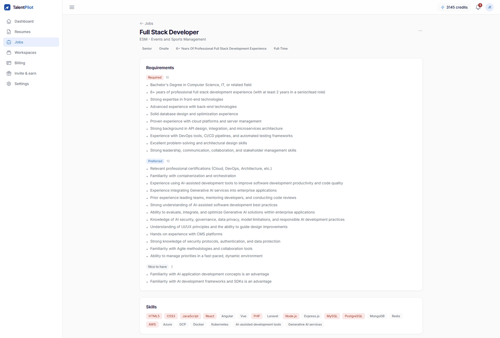<br><sub>Job description parsed into required, preferred and nice-to-have requirements and skills</sub></td>
  </tr>
  <tr>
    <td>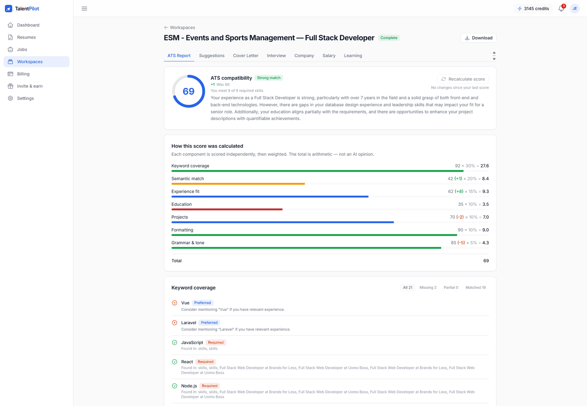<br><sub>ATS report: overall score, weighted score breakdown and keyword coverage</sub></td>
    <td>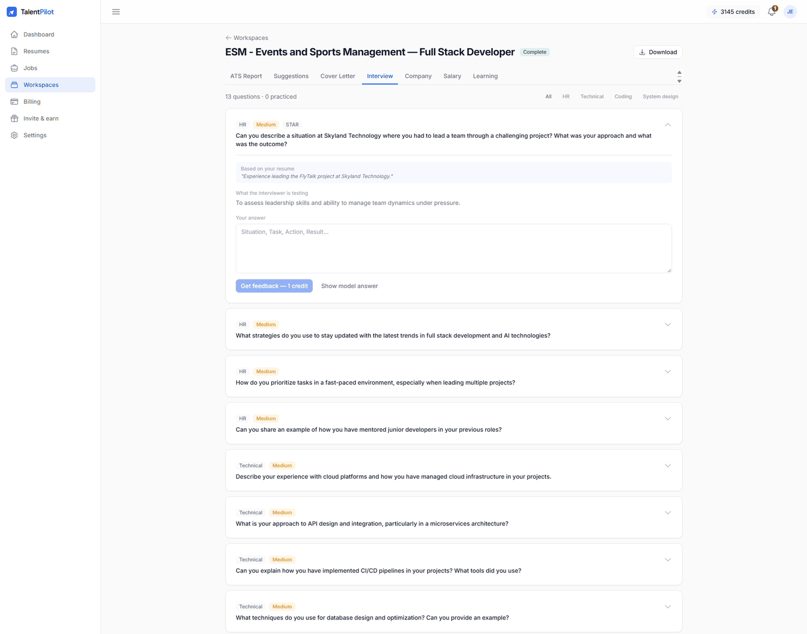<br><sub>Interview prep: HR, technical, coding and system-design questions grounded in the resume, with answer feedback</sub></td>
  </tr>
  <tr>
    <td>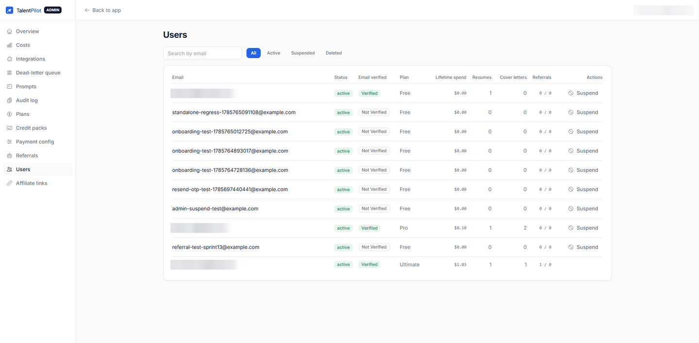<br><sub>Admin panel: user management (emails redacted)</sub></td>
    <td>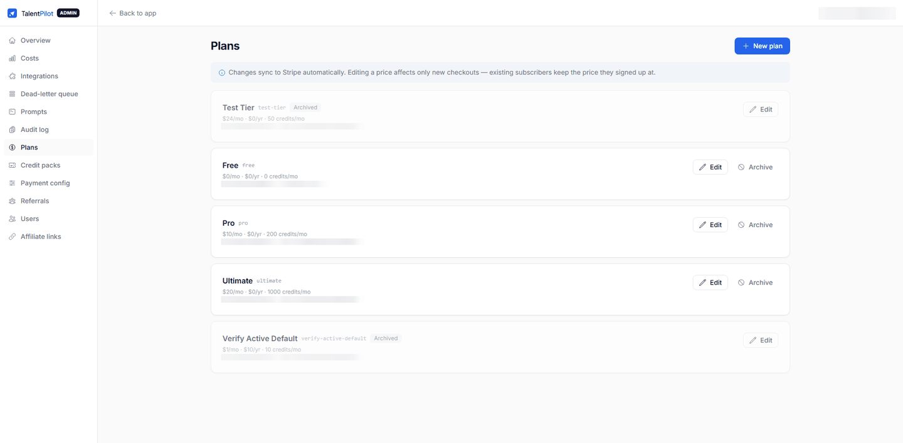<br><sub>Admin panel: subscription plans synced to Stripe (IDs redacted)</sub></td>
  </tr>
</table>

### Mobile

<table>
  <tr>
    <td align="center" valign="top">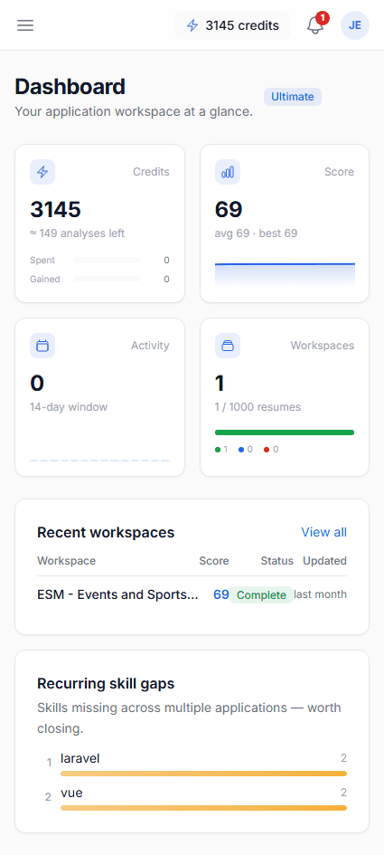<br><sub>Dashboard</sub></td>
    <td align="center" valign="top">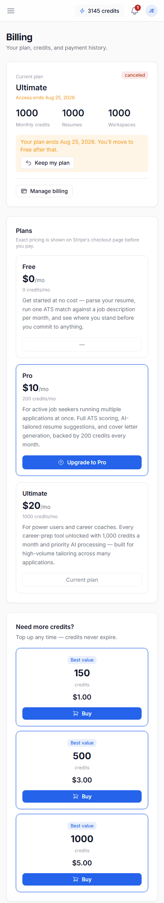<br><sub>Billing: current plan, plans and credit top-up packs</sub></td>
    <td align="center" valign="top">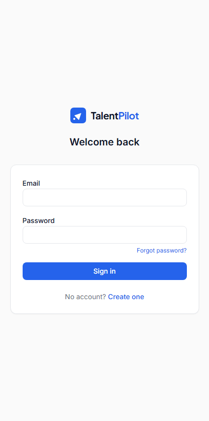<br><sub>Sign-in</sub></td>
    <td align="center" valign="top">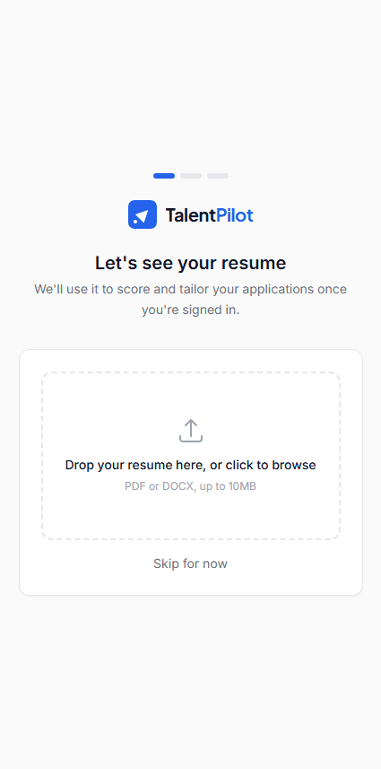<br><sub>Onboarding: resume upload step</sub></td>
    <td align="center" valign="top">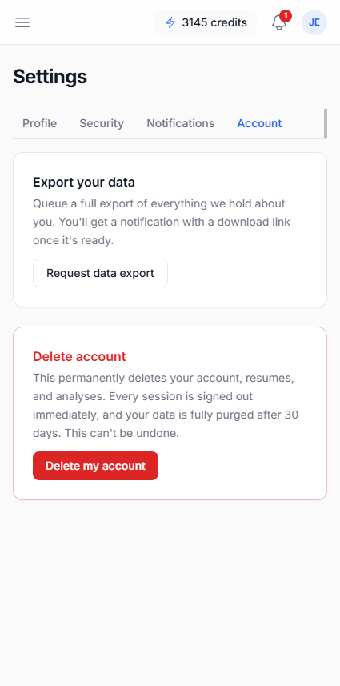<br><sub>Settings: data export and account deletion</sub></td>
  </tr>
</table>

## Key features

**Job-seeker app**
- Email/password auth with OTP email verification, password reset, session management and account deletion.
- Resume upload (drag and drop) with live parse status, structured section view, inline summary editing and version history with diff and forward-only restore.
- Job descriptions by paste or upload, parsed into requirements, skills and keywords, with a nudge to correct a missing company or position.
- **Workspaces** pair one resume with one job description. A pre-analysis match preview warns about a poor fit before credits are spent.
- Live analysis pipeline: progress streams over Server-Sent Events (short-lived ticket), with a polling fallback.
- Workspace tabs: ATS Report, Suggestions, Cover Letter, Interview, Company, Salary, Learning.
  - ATS report with score breakdown, keyword table, match band and before/after score after a recalculation.
  - Suggestions you can apply or reject in bulk. Ones the backend couldn't verify against the resume are marked as needing more information and are never bulk-applied.
  - Cover letter generation and regeneration, interview questions with scored answer feedback, company insight, salary estimate and a learning roadmap.
  - Document downloads (PDF and DOCX) via signed URLs.
- Credits and billing: balance, history, plan comparison, upgrade/downgrade/cancel, credit packs, Stripe checkout and portal.
- Referral / invite page, notification bell and preferences, profile settings, security settings and data export.

**Admin panel** (`/admin`, role plus email allowlist enforced by the backend)
- Overview, cost dashboard, integration usage, user management, plans, credit packs, payment configuration, referral oversight, affiliate links, prompt versions, queue dead letters, run inspector and audit log.

**Marketing site** (server-rendered): landing page, pricing (live plan catalog), three keyword landing pages, sitemap, robots and Open Graph image.

## Main pages

| Route group | Pages |
| --- | --- |
| `(marketing)` | `/`, `/pricing`, `/ats-resume-checker`, `/resume-optimizer`, `/ai-cover-letter` |
| `(auth)` | `/login`, `/register`, `/verify-email`, `/forgot-password`, `/reset-password` |
| `(app)` | `/dashboard`, `/resumes`, `/resumes/[id]`, `/jobs`, `/jobs/new`, `/jobs/[id]`, `/workspaces`, `/workspaces/[id]`, `/billing`, `/settings`, `/invite`, `/getting-started` |
| `(admin)` | `/admin`, `/admin/costs`, `/admin/integrations`, `/admin/users`, `/admin/plans`, `/admin/credit-packs`, `/admin/payment-config`, `/admin/referrals`, `/admin/affiliate-links`, `/admin/prompts`, `/admin/queues`, `/admin/runs/[id]`, `/admin/audit` |

## Tech stack

- **Framework:** Next.js 16 (App Router), React 19, TypeScript
- **Styling:** Tailwind CSS v4 (tokens in `app/globals.css`), Radix UI primitives, Heroicons, framer-motion
- **Server state:** TanStack Query
- **Client state:** Zustand (UI state and the in-memory access token only)
- **Forms and validation:** react-hook-form with zod
- **API integration:** a single axios client (`lib/api/client.ts`) with automatic token refresh, a typed `ApiError`, SSE helper (`lib/sse.ts`) and a polling hook; `/api/v1` is proxied through the app's own origin (`proxy.ts`)
- **Charts:** recharts
- **Tooling:** ESLint 9 with `eslint-config-next`

## Getting started

Prerequisites: Node.js 20+ and a running [talentpilot-api](https://github.com/njkr/talentpilot-api) instance.

```bash
npm install
cp .env.example .env.local   # then edit the values
npm run dev                  # http://localhost:3001
```

Other scripts:

```bash
npm run build   # production build
npm run start   # serve the production build
npm run lint    # ESLint
```

The backend's CORS allowlist must include `http://localhost:3001` if you call it directly instead of through the built-in proxy.

## Environment variables

| Name | Description | Required |
| --- | --- | --- |
| `NEXT_PUBLIC_API_URL` | API base URL used by the browser. `/api/v1` routes through this app's proxy; a full URL calls the backend directly. | Yes |
| `NEXT_PUBLIC_SITE_URL` | Public URL of this site, used for canonical URLs, sitemap, robots and Open Graph. Defaults to `http://localhost:3001`. | Optional |
| `BACKEND_API_ORIGIN` | Server-only backend origin that `proxy.ts` forwards `/api/v1/*` to (no trailing slash, no `/api/v1`). | Required when using the proxy |

## Project structure

```
app/              Routes (route groups: marketing, auth, app, admin)
components/       Shared UI: ui/ primitives, layout/, auth/, billing/
features/         One folder per domain (api, types, hooks, components)
hooks/            Shared hooks (polling, debounce)
lib/              API client, SSE helper, utilities, site config
providers/        Auth bootstrap and query provider
stores/           Zustand stores
proxy.ts          Proxies /api/v1 to the backend
docs/             API reference, Postman collection and screenshots
```

## Related repository

- Backend API: [talentpilot-api](https://github.com/njkr/talentpilot-api)

## Author

**Jenkins Raj**
- GitHub: [github.com/njkr](https://github.com/njkr)
- LinkedIn: [linkedin.com/in/jenkinsraj](https://www.linkedin.com/in/jenkinsraj)
- Email: jenkinsraj@hotmail.com
